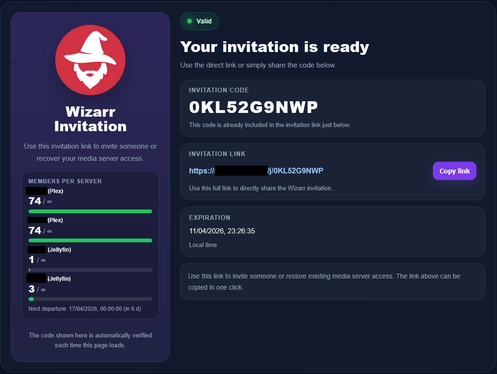

# wizarrInvite – Organizr Plugin v2.0

<p align="center">

</p>

<p align="center">

</p>

wizarrInvite is an Organizr plugin that lets you **generate and manage Wizarr invitation links directly from Organizr**.

Version 2.0 introduces **Automatic Slots** — independent invitation channels, each with its own URL, settings, and user limit — alongside a debug log viewer, improved performance, and a cleaner settings UI.

---

## Recommended Installation (Marketplace)

The easiest way to install this plugin is through the **custom Organizr marketplace repository**.

Repository:

```
https://github.com/Katsugami/Organizr-Plugins
```

### Add the repository to Organizr

Go to:

```
Settings → Plugins → Settings → Marketplace
```

In **External Marketplace Repo**, add:

```
https://github.com/Katsugami/Organizr-Plugins
```

Save, then go to **Plugins → Marketplace**. The wizarrInvite plugin will appear and can be installed directly.

---

## Manual Installation

Clone or download this repository into the Organizr plugins folder:

```
Organizr/api/plugins/wizarrInvite/
```

Required structure:

```
wizarrInvite/
├── plugin.php
├── api.php
├── routes.php
├── config.php
├── settings.js
├── page.php
├── main.js
├── wizarr.png
├── preview.png
├── display/
│   └── default/
│       ├── display-en.php
│       ├── display-fr.php
│       └── display-es.php
└── includes/
    ├── request.php
    ├── helpers.php
    ├── payload.php
    ├── invitations.php
    ├── cache.php
    ├── auto.php
    ├── slots.php
    ├── users.php
    ├── display.php
    ├── debug.php
    └── js/
        └── slots.js
```

Restart Organizr if necessary. The plugin will appear under **Settings → Plugins**.

---

## What's New in v2.0

### Automatic Slots

The core new feature. A **slot** is a permanent invitation channel with its own ID, settings, and public URL. You can create as many slots as you need — for example, one slot per access tier, language, or server.

Each slot has:
- Its own **display URL** (`/display/1`, `/display/2`, etc.)
- Independent server and library selection
- Its own user limit (`Max Users`)
- Its own invitation expiration and access duration
- Its own bundle (optional)
- A **Check / Recreate** button to force-refresh the invite code

The slot configuration is saved as a single JSON field in Organizr, with no extra database required.

### Debug Log Viewer

A new **Debug** section in settings lets you view and clear the plugin activity log directly from the UI. The log file is stored in the Organizr data cache directory:

```
/config/www/organizr/data/cache/wizarrinvite_debug.log
```

Logged events include: invite creation, cache hits, errors, and slot status checks.

### API Docs Links

The **API Tester** section now links directly to Wizarr's built-in Swagger / OpenAPI documentation page:

- Internal: `{Wizarr internal URL}/api/docs/`
- External: `{Wizarr public URL}/api/docs/` (shown only if a public URL is configured)

### Improved Performance

- Added **connection timeout** (`CURLOPT_CONNECTTIMEOUT`) on all HTTP requests. If a Plex server or Wizarr is unreachable, the request fails in at most 5 seconds instead of blocking for the full transfer timeout.
- Reduced `/users` timeout from 15 s to 8 s.
- Reduced `/servers` timeout from 10 s to 5 s.

### User Stats — Per-Server Breakdown

The **Check Users** button now shows a collapsible list of users per server. Click a server name to expand and see each user's username and expiry date.

### Bundle Support (Manual & Slots)

Both manual invitations and slots support a **Bundle ID** field:
- Leave empty → Wizarr uses the default bundle
- `1` → first bundle, `2` → second bundle, etc.

The Load Bundles button (which never worked reliably) has been removed in favour of this simple numeric input.

### Other Improvements

- Display files moved to `display/default/` subfolder, making it easier to add custom display templates.
- The `/display` route without a slot ID now returns a clear error message instead of generating an invitation: `⚠️ Missing slot ID. Use /display/1, /display/2, etc.`
- The save button in Organizr now appears automatically when adding or removing a slot.
- Emoji indicators on all status messages (✅ success, ❌ error, ⏳ loading).

---

## Features

- **Manual invitation creation** from the settings panel
- **Automatic Slots** — multiple independent invitation channels, each with a permanent URL
- Automatic invite validation and recreation when settings change
- Per-slot and global **user limit** enforcement
- Server and library selection (per slot and manual)
- Permission controls: Downloads, Live TV, Mobile Uploads, Plex Home
- **Public display pages** with multi-language support
- **Debug log** viewer and clear button
- **Wizarr API Docs** quick-access links
- Compatible with Organizr auto-translation

---

## Automatic Slots — How It Works

1. Create a slot in **Settings → Automatic Slots → + Add Slot**
2. Configure its label, servers, libraries, user limit, and permissions
3. Save
4. The slot's public URL is:

```
https://yourdomain.com/api/v2/plugins/wizarrinvite/display/[ID]
```

| Slot | URL |
|------|-----|
| Slot #1 | `/api/v2/plugins/wizarrinvite/display/1` |
| Slot #2 | `/api/v2/plugins/wizarrinvite/display/2` |
| Slot #3 | `/api/v2/plugins/wizarrinvite/display/3` |

When a user visits the URL:
- If a valid invite code exists in cache → served immediately (no Wizarr call)
- If the cache is missing or the config changed → a new invite is created automatically
- If the user limit is reached → the invitation is not served

Use this URL as the **homepage URL** in an Organizr tab.

---

## Display Language

The page shown to users is controlled by the **Display Used** field under **Display Language**.

Built-in options:

| Path | Language |
|------|----------|
| `display/default/display-en` | English |
| `display/default/display-fr` | French |
| `display/default/display-es` | Spanish |

To use a custom display, place a `.php` file anywhere inside the plugin folder and enter its relative path (without `.php`). The file must stay within the plugin directory.

This setting applies to all slots and the manual display at once.

---

## Cache Files

All generated files are stored in the Organizr data cache directory:

```
/config/www/organizr/data/cache/
```

| File | Purpose |
|------|---------|
| `wizarrinvite_slot_1.json` | Cached invite code for Slot #1 |
| `wizarrinvite_slot_2.json` | Cached invite code for Slot #2 |
| `wizarrinvite_debug.log` | Plugin activity log (auto-rotated at 100 KB) |

To force a new invite code for a slot, delete its `.json` file or click **Check / Recreate** on the slot card.

---

## Configuration Reference

### Wizarr Connection

| Field | Description |
|-------|-------------|
| Internal Wizarr URL | URL used by the server to reach Wizarr (e.g. `http://127.0.0.1:5690`) |
| Wizarr API Key | API key from Wizarr settings |
| Public URL | Optional — URL used for public invite links (e.g. `https://invite.yourdomain.com`) |

### Manual Invitation

| Field | Description |
|-------|-------------|
| Minimum Organizr Group | Minimum group required to create a manual invite |
| Wizarr Expiration | How long the invite link itself is valid |
| Access Duration (days) | How many days access is granted after the invite is used |
| Bundle | Bundle ID (empty = default, `1` = first, `2` = second…) |
| Allow Downloads | Grant download permission |
| Allow Live TV | Grant Live TV permission |
| Allow Mobile Uploads | Grant mobile upload permission |
| Invite to Plex Home | Add user to Plex Home |
| Servers and Libraries | Select which servers and libraries to grant access to |

### Automatic Slots

Each slot has the same permission fields as the manual invitation, plus:

| Field | Description |
|-------|-------------|
| Label | Display name for the slot card |
| Max Users | Maximum number of users before the invite is blocked |
| Server Count | Number of servers sharing the same Plex account (used for deduplication) |

---

## Compatibility

| Software | Tested version |
|----------|----------------|
| Organizr | 2.1.4010 |
| Wizarr | v2026.4.0 |

---

## Authors

Katsugami

AI development assistance: ChatGPT (v1.0) — Claude by Anthropic (v2.0)

The project structure, integration, testing, and assembly were performed by Katsugami.

---

## License

Personal project.
